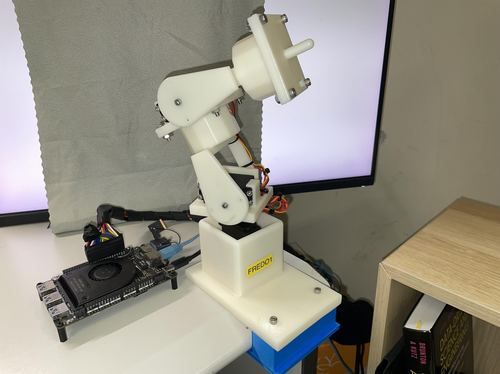
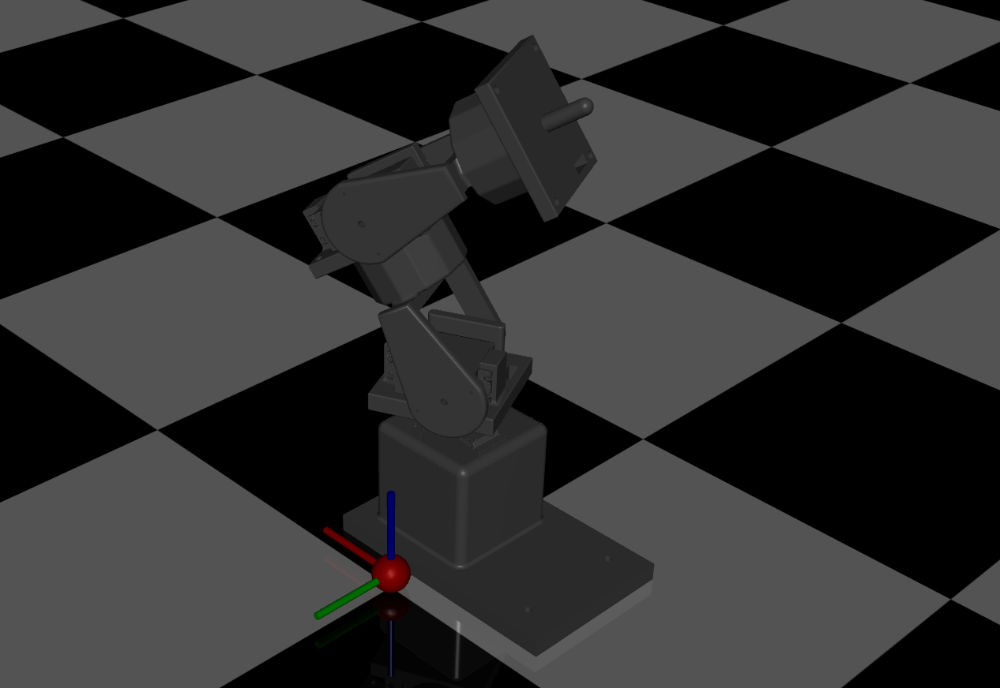

# Bootcamp for Fullstack Robotics Development

<table align="center">
    <tr>
      <td align="center">
        
      </td>
      <td align="center">
        
      </td>
    </tr>
</table>

## Introduction
This is a learning bootcamp for fullstack robotics development. The term "fullstack" here mainly refers the process from robot conceptualizing to 3D modelling, to numerical simulation, to firmware embedding and to final controller design. Here, we 

- homemade a naive 3-DOF manipulator with servos (FOC motor TBD) from scratch, 
- did simulations in mujoco/gazebo/bullet,
- maintained a digital twin with those platform,
- played with some fancy data-driven (PPO & Koopman) controllers.

Again, fundamentals in those aspects are grossly omitted; for those who have some basic knowledge, you are in the right place. In which, we have several components:

1. 3D modelling: [here](./fredo1/cad)
2. Numerical Simulation
    - Gazebo + ROS1: [Fredo1](./fredo1/gazebo) & [Dummy](./dummy/gazebo)
    - Mujoco: [Fredo1](./fredo1/mujoco) & [Dummy](./dummy/mujoco)
    - Pybullet: [Fredo1](./fredo1/pybullet/) & [Dummy](./dummy/pybullet)
3. Embedding with Arduino: [here](./fredo1/fredo1_firmware/)
4. Digital Twinning (kinda):
    - Gazebo + ROS1: [Fredo1](./fredo1/gazebo/) & [Dummy](./dummy/gazebo/)
    - Mujoco: [Fredo1](./fredo1/mujoco/) & [Dummy](./dummy/mujoco/)
    - Pybullet: [Fredo1](./fredo1/pybullet/) & [Dummy](./dummy/pybullet/)
5. Data-Driven Methods Demonstration:
    - RL w/ PPO
    - Koopman
<!-- 6. test -->
